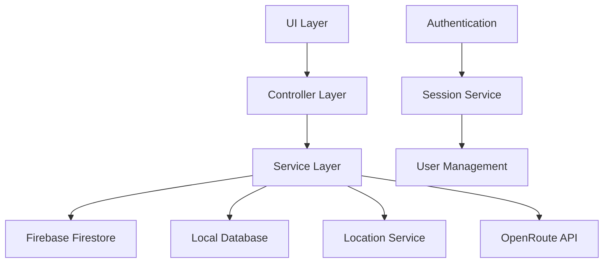

# 🍽️ LokaMakan - Restaurant Discovery App

<div align="center">


**Aplikasi pencari restoran berbasis Location Based Service (LBS) dengan teknologi Flutter dan Firebase**

</div>

## 📋 Daftar Isi

- [Tentang Aplikasi](#-tentang-aplikasi)
- [Fitur Utama](#-fitur-utama)
- [Teknologi yang Digunakan](#-teknologi-yang-digunakan)
- [Arsitektur Aplikasi](#-arsitektur-aplikasi)
- [Location Based Service (LBS)](#-location-based-service-lbs)
- [Setup & Instalasi](#-setup--instalasi)
- [Konfigurasi Firebase](#-konfigurasi-firebase)
- [Environment Variables](#-environment-variables)
- [Struktur Project](#-struktur-project)
- [API & Services](#-api--services)
- [Testing](#-testing)
- [Deployment](#-deployment)
- [Contributing](#-contributing)
- [License](#-license)

## 🎯 Tentang Aplikasi

**LokaMakan** adalah aplikasi mobile cross-platform yang dikembangkan menggunakan Flutter untuk membantu pengguna menemukan restoran terdekat dengan fitur Location Based Service (LBS) yang canggih. Aplikasi ini menintegrasikan berbagai teknologi modern untuk memberikan pengalaman pencarian restoran yang optimal.

### 🏆 Keunggulan Aplikasi

- **Location-Aware**: Deteksi lokasi real-time dengan akurasi tinggi
- **Cross-Platform**: Satu codebase untuk iOS dan Android
- **Real-time Data**: Sinkronisasi data restoran secara real-time
- **Offline Support**: Dukungan mode offline untuk data favorit
- **Navigation Integration**: Navigasi langsung ke restoran pilihan
- **User Authentication**: Sistem autentikasi dengan Google Sign-In

## ✨ Fitur Utama

### 🗺️ Location Based Service (LBS)
- **GPS Positioning**: Deteksi lokasi pengguna dengan akurasi tinggi
- **Distance Calculation**: Perhitungan jarak menggunakan Haversine formula
- **Proximity Filtering**: Filter restoran dalam radius tertentu
- **Real-time Navigation**: Integrasi dengan OpenRouteService API
- **Interactive Maps**: Peta interaktif dengan custom markers

### 🏪 Restaurant Discovery
- **Smart Search**: Pencarian restoran berdasarkan nama, kategori, dan lokasi
- **Filter & Sort**: Filter berdasarkan rating, jarak, dan kategori makanan
- **Restaurant Details**: Informasi lengkap restoran dengan foto dan review
- **Favorites**: Simpan restoran favorit dengan penyimpanan lokal
- **Real-time Updates**: Update data restoran secara real-time

### 👤 User Management
- **Google Authentication**: Login mudah dengan akun Google
- **Profile Management**: Kelola profil dan preferensi pengguna
- **Session Management**: Manajemen sesi yang aman dan efisien
- **User Preferences**: Pengaturan preferensi pencarian dan notifikasi

## 🚀 Teknologi yang Digunakan

### 🎨 Frontend Framework
- **Flutter 3.19.0**: Cross-platform mobile development framework
- **Dart 3.3.0**: Programming language optimized for mobile development
- **Material Design**: Consistent UI/UX design system

### 🗄️ Backend & Database
- **Firebase Cloud Firestore**: NoSQL cloud database untuk real-time data
- **Firebase Authentication**: Sistem autentikasi yang aman
- **Firebase Analytics**: Analytics dan crash reporting
- **Hive**: Local database untuk offline storage

### 🗺️ Location & Navigation Services
- **Geolocator**: High-accuracy GPS positioning
- **OpenRouteService API**: Routing dan navigation services
- **Flutter Map**: Interactive map dengan custom markers
- **LatLong2**: Geographical coordinate calculations

### 🏗️ Architecture & State Management
- **Modular Architecture**: Separation of concerns dengan package structure
- **GetX**: State management dan dependency injection
- **Go Router**: Declarative routing system
- **Provider Pattern**: Service-based architecture

### 🛠️ Development Tools
- **VS Code**: Primary IDE dengan Flutter extensions
- **Dio**: HTTP client untuk API communications
- **Build Runner**: Code generation dan build tools
- **Flutter Lints**: Code analysis dan quality assurance

## 🏗️ Arsitektur Aplikasi

### 📁 Package Structure

```
lib/
├── packages/
│   ├── core/                    # Core utilities dan shared services
│   │   ├── models/              # Data models dan entities
│   │   ├── services/            # Business logic services
│   │   ├── database/            # Local database management
│   │   ├── widgets/             # Reusable UI components
│   │   ├── themes/              # App theming dan styling
│   │   └── utils/               # Helper utilities
│   └── base/                    # Feature modules
│       ├── beranda/             # Home screen dengan restaurant list
│       ├── restaurant_detail/   # Detail restoran dengan LBS features
│       ├── favorites/           # Manajemen restoran favorit
│       ├── routing/             # Navigation dan route planning
│       ├── login/               # Authentication screens
│       └── splash_screen/       # App initialization
```

### 🔄 Data Flow Architecture



## 🗺️ Location Based Service (LBS)

### 📍 Core LBS Implementation

#### GPS Positioning
```dart
class LocationService {
  static Future<Position?> getCurrentLocation() async {
    Position position = await Geolocator.getCurrentPosition(
      desiredAccuracy: LocationAccuracy.high,
      timeLimit: const Duration(seconds: 10),
    );
    return position;
  }
}
```

#### Distance Calculation
```dart
static double calculateDistance(double lat1, double lon1, double lat2, double lon2) {
  // Haversine formula implementation
  const double earthRadius = 6371.0; // Earth's radius in kilometers
  
  double lat1Rad = lat1 * pi / 180;
  double lon1Rad = lon1 * pi / 180;
  double lat2Rad = lat2 * pi / 180;
  double lon2Rad = lon2 * pi / 180;

  double dLat = lat2Rad - lat1Rad;
  double dLon = lon2Rad - lon1Rad;

  double a = sin(dLat / 2) * sin(dLat / 2) +
      cos(lat1Rad) * cos(lat2Rad) * sin(dLon / 2) * sin(dLon / 2);

  double c = 2 * atan2(sqrt(a), sqrt(1 - a));
  return earthRadius * c;
}
```

### 🧭 Navigation Integration

#### OpenRouteService Integration
```dart
class OpenRouteService {
  static Future<RouteResponse> getDirections({
    required LatLng start,
    required LatLng end,
    String profile = 'driving-car',
  }) async {
    // Implementation untuk mendapatkan rute navigasi
    // Mendukung driving-car, foot-walking, cycling-regular
  }
}
```

### 📊 LBS Features

| Feature | Description | Technology |
|---------|-------------|------------|
| **GPS Tracking** | Real-time location detection | Geolocator package |
| **Distance Calculation** | Accurate distance measurement | Haversine formula |
| **Proximity Search** | Find restaurants within radius | Geospatial queries |
| **Route Planning** | Navigation to restaurants | OpenRouteService API |
| **Location Caching** | Offline location data | Hive local storage |

## 🔧 Setup & Instalasi

### 📋 Prerequisites

- Flutter SDK 3.19.0 atau lebih baru
- Dart SDK 3.3.0 atau lebih baru
- Android Studio / VS Code
- Firebase account
- OpenRouteService API key

### 🛠️ Instalasi

1. **Clone Repository**
   ```bash
   git clone https://github.com/rival809/sertifikasi-lokamakan.git
   cd sertifikasi-lokamakan
   ```

2. **Install Dependencies**
   ```bash
   flutter pub get
   ```

3. **Setup Environment Variables**
   ```bash
   cp .env.example .env
   # Edit .env file dengan API keys yang diperlukan
   ```

4. **Configure Firebase**
   - Download `google-services.json` untuk Android
   - Download `GoogleService-Info.plist` untuk iOS
   - Place files di direktori yang sesuai

5. **Run Application**
   ```bash
   flutter run
   ```

## 🔥 Konfigurasi Firebase

### 📱 Firebase Services Setup

1. **Create Firebase Project**
   - Buka [Firebase Console](https://console.firebase.google.com/)
   - Create new project: `loka-makan`
   - Enable Google Analytics (optional)

2. **Add Android App**
   ```
   Package name: com.example.lokamakan
   App nickname: LokaMakan Android
   SHA-1: [Your SHA-1 certificate fingerprint]
   ```

3. **Add iOS App**
   ```
   Bundle ID: com.example.lokamakan
   App nickname: LokaMakan iOS
   ```

4. **Enable Firebase Services**
   - **Authentication**: Google Sign-In
   - **Cloud Firestore**: Database untuk restaurant data
   - **Analytics**: User behavior tracking
   - **Crashlytics**: Crash reporting

### 🗃️ Firestore Database Structure

```
restaurants/
├── [restaurant_id]/
│   ├── name: string
│   ├── location: GeoPoint
│   ├── address: string
│   ├── city: string
│   ├── rating: number
│   ├── pictureUrl: string
│   ├── description: string
│   ├── categories: array
│   ├── priceRange: string
│   ├── isActive: boolean
│   └── createdAt: timestamp

users/
├── [user_id]/
│   ├── uid: string
│   ├── email: string
│   ├── displayName: string
│   ├── photoURL: string
│   ├── preferences: object
│   └── createdAt: timestamp
```

## 🌍 Environment Variables

### 📝 Required Environment Variables

Create `.env` file in root directory:

```bash
# OpenRouteService API Configuration
OPENROUTESERVICE_API_KEY=your_api_key_here

# Firebase Configuration (optional - using firebase_options.dart)
FIREBASE_API_KEY=your_firebase_api_key
FIREBASE_APP_ID=your_firebase_app_id
FIREBASE_PROJECT_ID=loka-makan

# App Configuration
APP_NAME=LokaMakan
APP_VERSION=1.0.0
```

### 🔑 API Keys Setup

1. **OpenRouteService API Key**
   - Visit [OpenRouteService](https://openrouteservice.org/dev/#/signup)
   - Sign up for free account
   - Get API key and add to `.env`

2. **Firebase Configuration**
   - Download `firebase_options.dart` from FlutterFire CLI
   - Or manually configure in `.env`

## 📂 Struktur Project

### 🏗️ Detailed Project Structure

```
sertifikasi/
├── android/                     # Android platform files
├── ios/                         # iOS platform files
├── lib/
│   ├── main.dart               # App entry point
│   ├── setup.dart              # App initialization
│   ├── core_package.dart       # Core package exports
│   └── packages/
│       ├── core/               # Core shared modules
│       │   ├── models/         # Data models
│       │   │   ├── user_model.dart
│       │   │   └── restaurant_location_model.dart
│       │   ├── services/       # Business logic services
│       │   │   ├── auth_service.dart
│       │   │   ├── firestore_service.dart
│       │   │   ├── location_service.dart
│       │   │   ├── restaurant_service.dart
│       │   │   └── openroute_service.dart
│       │   ├── database/       # Local database
│       │   │   ├── favorite_database.dart
│       │   │   └── theme_database.dart
│       │   ├── widgets/        # Reusable UI components
│       │   │   ├── base_button/
│       │   │   ├── base_card/
│       │   │   ├── restaurant_card/
│       │   │   └── drawer/
│       │   ├── themes/         # App theming
│       │   │   ├── theme.dart
│       │   │   └── theme_config.dart
│       │   └── utils/          # Helper utilities
│       └── base/               # Feature modules
│           ├── splash_screen/  # App initialization
│           ├── login/          # Authentication
│           ├── register/       # User registration
│           ├── beranda/        # Home screen
│           ├── restaurant_detail/ # Restaurant details
│           ├── favorites/      # Favorites management
│           ├── routing/        # Navigation features
│           └── admin_restaurant/ # Admin features
├── assets/                     # Static assets
│   ├── icons/                  # App icons
│   └── images/                 # App images
├── firebase.json              # Firebase configuration
├── firestore.rules           # Firestore security rules
├── .env                      # Environment variables
├── pubspec.yaml             # Dependencies configuration
└── README.md               # Project documentation
```

## 🔗 API & Services

### 🌐 External APIs

| Service | Purpose | Documentation |
|---------|---------|---------------|
| **OpenRouteService** | Navigation & routing | [docs](https://openrouteservice.org/dev/#/api-docs) |
| **Firebase Auth** | User authentication | [docs](https://firebase.google.com/docs/auth) |
| **Cloud Firestore** | Real-time database | [docs](https://firebase.google.com/docs/firestore) |
| **Google Maps** | Map integration | [docs](https://developers.google.com/maps) |

### 🔧 Internal Services

#### LocationService
- GPS positioning dengan high accuracy
- Distance calculation menggunakan Haversine formula
- Proximity filtering dan sorting
- Permission management

#### RestaurantService
- CRUD operations untuk restaurant data
- Real-time data synchronization
- Search dan filtering capabilities
- Firestore integration

#### AuthService
- Google Sign-In integration
- User session management
- Profile data management
- Security implementation

#### OpenRouteService
- Route calculation
- Turn-by-turn navigation
- Multiple transport modes
- Distance & duration estimation

## 🧪 Testing

### 🔍 Testing Strategy

```bash
# Unit Tests
flutter test test/unit_test.dart

# Widget Tests
flutter test test/widget_test.dart

# Integration Tests
flutter test integration_test/

# Coverage Report
flutter test --coverage
```

### 📊 Test Coverage

- **Unit Tests**: Service layer testing
- **Widget Tests**: UI component testing
- **Integration Tests**: End-to-end user flows
- **Golden Tests**: UI consistency testing

## 📦 Deployment

### 🤖 Android Deployment

```bash
# Build APK
flutter build apk --release

# Build App Bundle
flutter build appbundle --release

# Install on device
flutter install
```

### 🍎 iOS Deployment

```bash
# Build iOS
flutter build ios --release

# Build IPA
flutter build ipa --release
```

### 🚀 CI/CD Pipeline

```yaml
# .github/workflows/flutter.yml
name: Flutter CI/CD
on: [push, pull_request]
jobs:
  test:
    runs-on: ubuntu-latest
    steps:
      - uses: actions/checkout@v3
      - uses: subosito/flutter-action@v2
      - run: flutter pub get
      - run: flutter test
      - run: flutter build apk
```

## 🤝 Contributing

### 🔧 Development Guidelines

1. **Fork** repository ini
2. **Create** feature branch (`git checkout -b feature/AmazingFeature`)
3. **Commit** changes (`git commit -m 'Add some AmazingFeature'`)
4. **Push** to branch (`git push origin feature/AmazingFeature`)
5. **Open** Pull Request

### 📋 Code Style

- Follow [Dart Style Guide](https://dart.dev/guides/language/effective-dart/style)
- Use `flutter analyze` untuk code analysis
- Format code dengan `dart format`
- Add documentation untuk public APIs

### 🐛 Bug Reports

Gunakan [GitHub Issues](https://github.com/rival809/sertifikasi-lokamakan/issues) untuk melaporkan bug dengan template:

- **Description**: Deskripsi singkat masalah
- **Steps to Reproduce**: Langkah-langkah reproduksi
- **Expected Behavior**: Behavior yang diharapkan
- **Screenshots**: Screenshot jika diperlukan
- **Environment**: Device, OS version, app version

## 📄 License

Project ini dilisensikan under MIT License - lihat file [LICENSE](LICENSE) untuk detail.

## 👥 Team

- **Developer**: [rival809](https://github.com/rival809)
- **Project Type**: Sertifikasi Mobile Development
- **Framework**: Flutter + Firebase

## 🙏 Acknowledgments

- [Flutter Team](https://flutter.dev/) untuk amazing framework
- [Firebase](https://firebase.google.com/) untuk backend services
- [OpenRouteService](https://openrouteservice.org/) untuk navigation API
- [Material Design](https://material.io/) untuk design system

---

<div align="center">

**⭐ Jika project ini membantu, berikan star di GitHub! ⭐**

[🐛 Report Bug](https://github.com/rival809/sertifikasi-lokamakan/issues) • [✨ Request Feature](https://github.com/rival809/sertifikasi-lokamakan/issues) • [📖 Documentation](https://github.com/rival809/sertifikasi-lokamakan/wiki)

</div>
